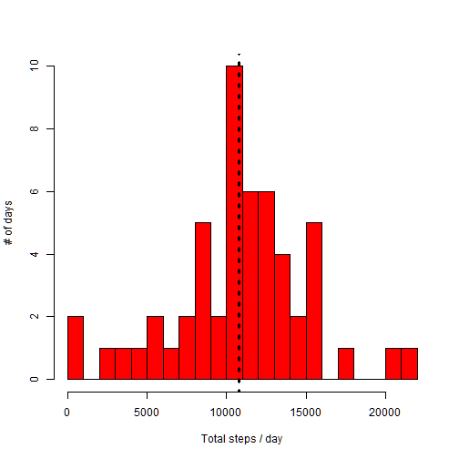
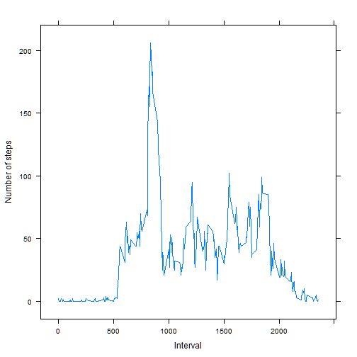
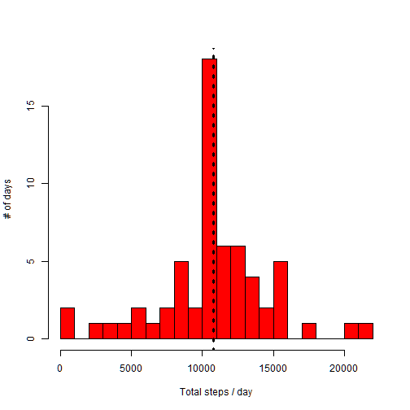
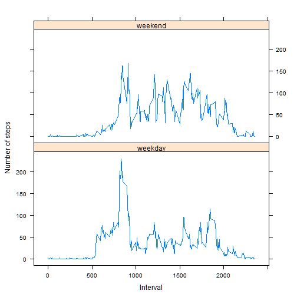

# Reproducible Research: Peer Assessment 1


## Preparation
The rest of the document assumes that the activity data is available in CSV format.
The CSV may be in a ZIP file, in which case it will be extracted from there.
The following variables need to be set to give the proper location and file names.

*Make changes to these variables if your locations or names differ.*


```r
activity.data.dir<-"."
activity.data.csv<-"activity.csv"
activity.data.zip<-"activity.zip"
```

At this point we'll define some utility functions that we'll use later.

```r
# Format a number with coma separators and at most one decimal digit
fmt <- function(n) format(n,big.mark=',',digits=ceiling(log10(n))+1)
# Convert an interval given as an HHMM decimal number to minutes.
interval2Minute <- function(i) i%/%100*60+i%%60
```
We'll make use of the Lattice plotting system below, hence we load it here.

```r
library(lattice)
```


## Loading and preprocessing the data
First define variables with full file names for ease of use:

```r
activity.file<-paste(activity.data.dir,activity.data.csv,sep="/")
activity.zip <-paste(activity.data.dir,activity.data.zip,sep="/")
```


```r
source <- ifelse(file.exists(activity.file),
                 activity.file,
                 sprintf("%s[%s]",activity.zip,activity.data.csv))
```

If the data has already been unzipped just load it, otherwise get it from the zip file.

```r
if (file.exists(activity.file)) {
   data <- read.csv(activity.file)
} else {
   data <- read.csv(unz(activity.zip,activity.data.csv))
}
```

```r
load.status=ifelse(length(data)>0,"successfully loaded","failed to load")
```
**We successfully loaded the data from ./activity.zip[activity.csv]**.

The data looks like this:

```r
str(data)
```

```
## 'data.frame':	17568 obs. of  3 variables:
##  $ steps   : int  NA NA NA NA NA NA NA NA NA NA ...
##  $ date    : Factor w/ 61 levels "2012-10-01","2012-10-02",..: 1 1 1 1 1 1 1 1 1 1 ...
##  $ interval: int  0 5 10 15 20 25 30 35 40 45 ...
```


## What is mean total number of steps taken per day?
First let's aggregate the steps taken broken down by day. Note that this version of
aggregate ignores missing values by default.

```r
steps.day<-aggregate(steps ~ date,data,sum)
```
We can calculate the mean and median of the totals:

```r
steps.mean  <-mean(steps.day$steps)
steps.median<-median(steps.day$steps)
```
Now lets draw a histogram of # of steps taken on a day by how many days we took that many steps.
The dashed line is the mean number of steps taken on a day.

```r
hist(steps.day$steps,breaks=20,main="",ylab="# of days",xlab="Total steps / day",col="red")
lines(c(steps.mean,steps.mean),c(-5,15),lty=3,lwd=3)
```

 

The **mean** of the steps taken per day is **10,766.2**
while the **median** is **10,765**.


## What is the average daily activity pattern?
Let's compute the average number of steps taken accross all days in a given
5 minute interval. Also construct a vector of unique interval identifiers; we'll
have occasion to use this variable again below.

```r
iMean<-function(i) round(mean(data[data$interval==i,'steps'],na.rm=T))
intervals <- unique(data$interval)
meansByInterval<-data.frame(interval=intervals,avg=sapply(intervals,iMean))
```
All we need to do now is plot it; Lattice will be used.

```r
xyplot(avg ~ interval,meansByInterval,type='l',ylab='Number of steps',xlab='Interval')
```

 

The maxium average across all intervals is now computed as well as the set of intervals
in which it occurs:

```r
maxAverage<-max(meansByInterval$avg)
maxAvgIntervals<-meansByInterval[meansByInterval$avg==maxAverage,'interval']
```

The maximum average number of steps in any one interval is **206** and
it occurs in the interval(s) **835.**

## Imputing missing values
We notice that there are many observations with no data for steps. How many?

```r
missing.values=sum(is.na(data$steps))
missing.pct=missing.values/length(data$steps)*100
```
There are in fact **2,304** missing values, or 
**13.1%** of the observations.

This might have a non-negligible effect on our computations so let's try to
replace the missing measurements with some reasonable value. An easy choice is
to take the mean for the given interval accross all days.

I don't have time right now to think of a more elegant way to do this, so I'll
do it with a loop:

```r
I.data <- data
for (intervalID in intervals) {
   I.data[is.na(data$steps) & data$interval==intervalID,]$steps <- 
      mean(data[data$interval==intervalID,'steps'],na.rm=T)
}
```

Let's repeat what we did before for total number of steps with the imputed data.


```r
I.steps.day<-aggregate(steps ~ date,I.data,sum)
I.steps.mean  <-mean(I.steps.day$steps)
I.steps.median<-median(I.steps.day$steps)
```

```r
hist(I.steps.day$steps,breaks=20,main="",ylab="# of days",xlab="Total steps / day",col="red")
lines(c(I.steps.mean,I.steps.mean),c(-5,25),lty=3,lwd=3)
```

 

Now using the modfied data the **mean** of the steps taken per day is **10,766.2**
while the **median** is **10,766.2**.

What we observe is that the mean and median changed only slightly comapred to computations
on the raw data (this is no surprise since we replaced missing values with the mean value
accross all other days). However the *distribution* has changed dramatically as is
confirmed by jus a glance at the two histograms.

## Are there differences in activity patterns between weekdays and weekends?
For some more analysis let's add a variable to the data to diffrentiate between
weekdays and weekends.

```r
I.data$day<-factor(weekdays(as.Date(I.data$date)) %in% c("Saturday","Sunday"),
                   labels=c("weekday","weekend"))
```

The we'll build a data frame which has 3 columns:

 1. The interval
 2. A day type: weekday or weekend
 3. The average number of steps for that interval accross all days of the given type.

We compute this in two steps: first for weekdays, then for weekends.

```r
typedMean<-function(i,d) round(mean(I.data[I.data$interval==i & I.data$day==d,'steps']))
minutes<-interval2Minute(intervals)
typedMeansByInterval<-rbind(
      data.frame(interval=intervals,day='weekday',avg=sapply(intervals,typedMean,'weekday')),
      data.frame(interval=intervals,day='weekend',avg=sapply(intervals,typedMean,'weekend')))
```

OK ... so lets do some visialization. We'll use Lattice for this, because it
makes it so easy to get panels.


```r
xyplot(avg ~ interval | day,typedMeansByInterval,
        layout=c(1,2),type='l',ylab='Number of steps',xlab='Interval')
```

 

